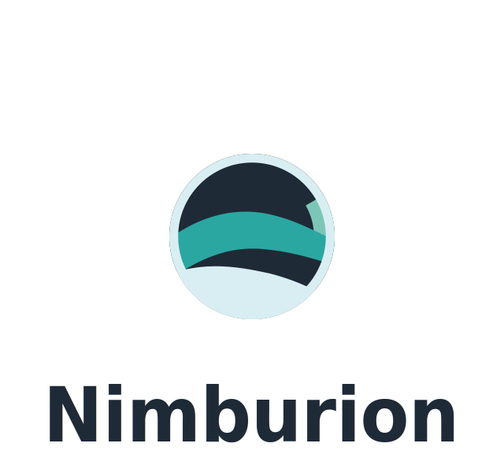

  

<h1 align="center">Nimburion</h1>

  Go ecosystem for building and orchestrating cloud-native microservices with production-grade reliability and operational control.

  <a href="https://https://nimburion.github.io/">Site</a>
  ·
  <a href="https://https://nimburion.github.io//wiki">Wiki</a>
  ·
  <a href="https://github.com/nimburion?tab=repositories">Repositories</a>

---

## About
Nimburion was created to make distributed-system growth governable.
It combines components, conventions, and tooling to help teams design cloud-native microservices with robust operations, measurable reliability, and sustainable scalability.

## Why Nimburion
- Production-ready patterns, modules, and guardrails
- Reliability-first practices: observability, resilience, and operational discipline
- Lifecycle and orchestration tooling for services and environments
- Go-native development focused on clarity, performance, and maintainability

## Core Projects
- [Nimburion](https://github.com/nimburion/nimburion): Core ecosystem and framework for disciplined Go microservice development.
- [API Gateway](https://github.com/nimburion/apigateway): Edge routing, policy enforcement, authentication/authorization checks, rate limiting, and traffic orchestration.
- [Bootstrapper](https://github.com/nimburion/bootstrapper): Service initialization and default setup conventions to reduce friction and improve consistency.

